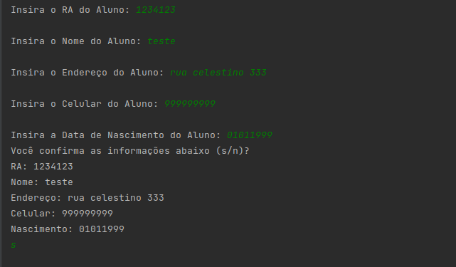
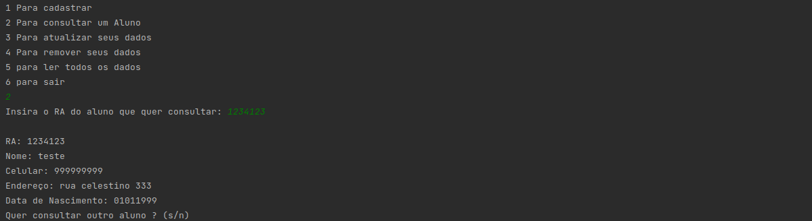
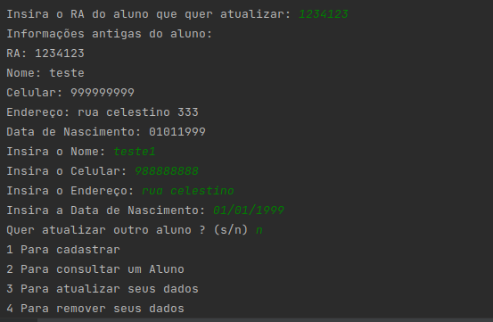
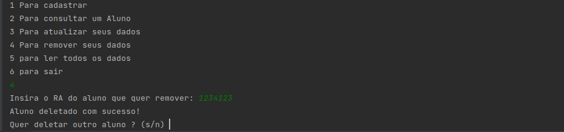
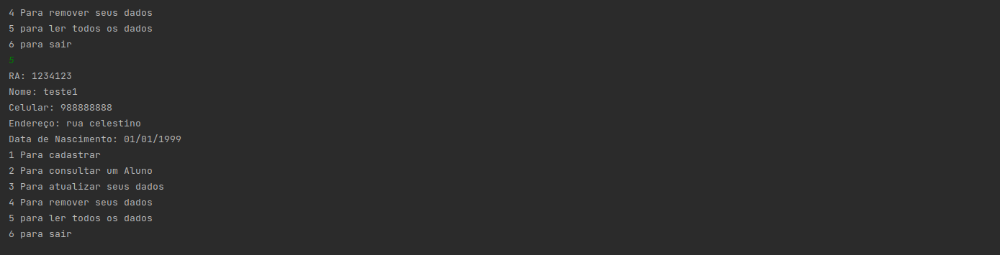

## Integrantes do grupo:

*  Erick Samuel Salazar do Carmo RA 1905066
*  Erik Danton Ozzetti Martins RA 1905319
*  Guilherme Augusto da Silva Costa RA 1905030
*  Gustavo Matoso de Oliveira RA 1905058
*  Israel Tavares Ribeiro RA 1905029
*  Weslley Schunemann RA 1904751

# Mini SGBD

Neste mini SGBD, foi usado hash para a indexação dos dados.

* Inserir quantos alunos desejar com todos os seus dados.

* Listar todos os alunos inseridos com todos os seus dados.

* Consultar alunos usando o RA, exibindo todos os dados dos alunos.

* Remoção de um aluno.

* Atualizar o aluno através da identificação pelo RA.

## Aluno
  ### Atributos de Aluno
* ra (Atributo chave)
* nome
* endereço
* celular 
* data de Nascimento

## Interface 

Ao iniciar o programa, ele mostrará uma tela com as opções 1 Para cadastrar, 2 Para consultar um Aluno, 3 Para atualizar seus dados, 4 Para remover seus dados, 5 para ler todos os  dados e 6 sair.

  
  
* Caso escolha 1 ira ter essa tela :
 
   
   
  
* Caso escolha  2 ira ter essa tela :
  
      
  
   
* Caso escolha 3 ira ter essa tela :

   
   
  
* Caso escolha 4 ira ter essa tela:

  
  
* Caso escolha 5 ira ter essa tela :
  
    

* Caso escolha 6 ira sair

### Packages 

#### Tela
É onde é executado o programa numa class do mesmo nome, nesse package tem o mínimo possivel de parte lógica, pois, esse packages só mostram a tela inicial.

### Funcoes 

É onde é feito a maior parte da lógica de cadastrar um aluno, remover, ver apenas um aluno e deletar o aluno. 

### Aluno  

 É onde está os atributos que o aluno possui.

### exceptions 

É onde está a exceções do programa.

### DicionárioHash 

É onde está toda lógica do hash.

### Json
 Responsável por salvar os cadastros no programa.

### Array e tadPilha

É onde está toda a lógica de pilha.

### Esse mini SGBD foi criado usando o java 17, e foi utlizado o pacote json simples.

   
