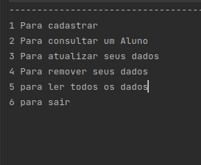

# Mini SGBD

Nesse mini SGBD foi usado hash para a indexação dos dados.

* O mini SGBD  possibilita a  criação de dados e salvar.

* Atualizar dados passando seu Ra pois  esta sendo usando como se fosse chave primaria.

* Deletar Passando um ra especifico.

* Visualizar todos os dados cadastrados Nesse Mini SGBD.

## Aluno

* RA
* Nome
* Endereço
* celular 
* data de Nascimento

## Interface 

Quando inicia o ira  ver uma tela com  algumas opções do Tipo  criar um novo aluno, atualizar , deletar e ve todos alunos
cadastrados 

  
